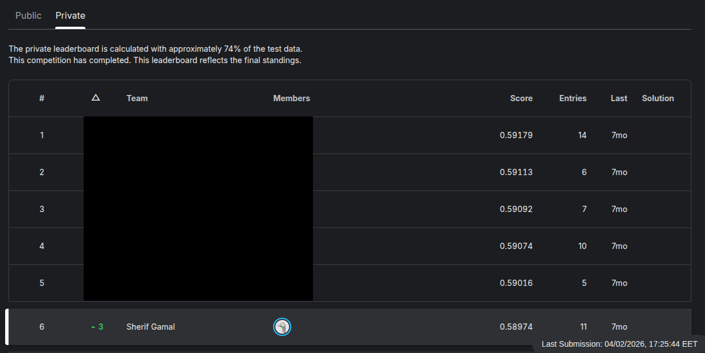

# Product Failure Prediction — a low-signal, distribution-shift problem

Second competition of my machine learning course (ITI Intake 46), on the Kaggle
*Tabular Playground Series — August 2022* dataset.

**Task:** a manufacturer tests each unit of a product and records a set of physical
measurements. Given those measurements, predict the probability that a unit **fails**
quality control.

| | |
|---|---|
| **Type** | Binary classification, probabilistic |
| **Metric** | ROC-AUC |
| **Train / test** | 26,570 / 20,775 rows, 24 features |
| **Best local CV** | **0.5912** AUC |
| **Final model** | Rank-average of a RankGauss + swish MLP and an L2 logistic regression |

If the headline number looks broken — it isn't. The maximum achievable AUC on this
dataset is around **0.59**. The signal is genuinely that weak, and that fact shaped
every decision in the notebook.

## Leaderboard

ITI Intake 46 InClass competition — the same public TPS Aug 2022 data, ranked within my
cohort. Private leaderboard, scored on ~74% of the test data:

| # | Score (AUC) |
|---|---|
| 1 | 0.59179 |
| 2 | 0.59113 |
| 3 | 0.59092 |
| 4 | 0.59074 |
| 5 | 0.59016 |
| **6 — mine** | **0.58974** |



Sixth, 0.00205 behind first. The fold standard deviation in my own grouped CV was ~0.007.

## The data

- `product_code` — `A`–`E` in train, **`F`–`I` in test**. The test set contains product
  codes that appear nowhere in training.
- `loading` — a continuous load measurement, heavily right-skewed.
- `attribute_0`–`attribute_3` — product-level properties (constant within a product code).
- `measurement_0`–`measurement_17` — per-unit measurements, with missing values scattered
  through most of them.
- `failure` — the target, ~21% positive.

## Approach

### 1. Validation before modelling

`product_code` differs between train and test, so the test set is made entirely of
products the model has never seen. The validation that matches that is
**`StratifiedGroupKFold` grouped on `product_code`** — each fold holds out a whole
product, so the score measures generalisation to an unseen product.

I built that first. Then, from the model-comparison cell onward, I switched to a plain
`StratifiedKFold` and never switched back. Every table in S2, S3 and S5 below was scored
with the random split, not the grouped one.

I have since re-run the comparisons under the grouped split in `01_solution.ipynb`. The
conclusions hold, and the numbers barely move:

| | Random split | Grouped split |
|---|---|---|
| Logistic regression | 0.5893 | 0.58939 |
| RankGauss + swish MLP | 0.5912 | 0.59191 |
| Same LR on raw features, controlled comparison | 0.58747 | 0.58743 |

**The split makes no measurable difference here** — about 5e-5 on the controlled
comparison, against a fold standard deviation of ~0.007. That is not the result I
expected, and it is worth stating plainly rather than implying the grouped CV rescued the
analysis.

The reason it doesn't bite: the per-unit `measurement_*` columns carry almost no
product-specific structure, and the only genuinely product-level fields
(`attribute_0`–`attribute_3`) are constant within a code and were dropped during feature
selection. There is nothing product-specific left to memorise, so holding a product out
costs the model nothing.

That is still the useful lesson, just not the one I assumed. The grouped split was the
right design — it is the only one that *could* have exposed leakage, and you cannot know
in advance that there is none to expose. But building the right validation and then
reporting numbers from a different one is how you end up describing an analysis you
didn't run.

The private leaderboard came in at **0.58974**, inside the range that every estimate here
gives. The CV was well calibrated either way.

**A measurement note.** Under grouped CV, the mean of the per-fold AUCs (0.59191) and the
AUC of the pooled out-of-fold predictions (0.58311) differ by 0.009. That is not
overfitting — each fold holds out a different product, so the folds' predicted
probabilities sit on slightly different scales, and pooling them before ranking penalises
the score. Mean-of-folds is the figure comparable to a random-split CV; the pooled number
is not.

### 2. Linear models beat trees

Scored with plain `StratifiedKFold` — see the caveat in §1:

| Model | Mean AUC | Std |
|---|---|---|
| **Logistic regression** | **0.5893** | 0.0072 |
| XGBoost | 0.5835 | 0.0054 |
| CatBoost | 0.5770 | 0.0069 |

Gradient boosting lost, consistently. When the true signal is a weak, nearly-linear
relationship, trees spend their capacity carving up noise; a strongly regularised linear
model can't. The Optuna search over logistic regression converged to `C ≈ 0.0074` —
i.e. "regularise almost everything away," which is exactly the right answer here.

### 3. Imputation didn't matter

| Strategy | Mean AUC | Std |
|---|---|---|
| Simple mean | 0.5831 | 0.0066 |
| KNN | 0.5832 | 0.0071 |
| Iterative (MICE) | 0.5823 | 0.0076 |

Three approaches, differences well inside one standard deviation. I kept `SimpleImputer`.

### 4. Feature selection and interactions

L1-penalised logistic regression zeroed out `measurement_1`, `_3`, `_6`, `_8`, `_11`,
`_12`, `_15`, `_16` outright. SHAP interaction values on an XGBoost probe identified
`measurement_13` as a hub feature, so I added explicit products
(`measurement_13 × loading`, `× measurement_10`, `× measurement_17`, …). The final
feature set is 10 main effects plus 3 interactions — 13 columns out of 24.

**The bug worth recording:** I log-transformed `loading` in train but not in test, so the
`measurement_13 × loading` interaction was computed on values ~27× larger on one side.
Predicted probabilities came out around 0.02 instead of the expected ~0.21. The fix was
to concatenate train and test, transform once, then split back — and to add a sanity
assertion on the mean predicted probability before writing any submission.

### 5. Neural networks

`QuantileTransformer(output_distribution='normal')` — **RankGauss** — as the scaler,
swish activations, BatchNorm, dropout, and `ReduceLROnPlateau`. Architecture sweep:

| Architecture | Mean AUC | Std |
|---|---|---|
| Funnel 64→32 | 0.5584 | 0.0093 |
| Bottleneck 32→8 | 0.5769 | 0.0056 |
| High dropout 128→64 | 0.5860 | 0.0070 |
| Balanced scale-up | 0.5903 | 0.0048 |
| **Heavy net** | **0.5912** | 0.0055 |
| Funnel taper | 0.5901 | 0.0072 |

RankGauss was worth more than any architecture change — it maps each feature to a
Gaussian by rank, which suits a linear-ish decision boundary and is robust to the skew in
`loading`. I also reimplemented a public winning solution's "fractal tree" network
(recursive branching to depth 5, leaves concatenated) to see whether the exotic topology
was doing the work. It scored in line with the plain heavy net — the preprocessing was
the winner's real edge, not the architecture.

### 6. Blending on ranks, not probabilities

AUC only cares about ordering, so the models are blended by converting each prediction
vector to ranks (`scipy.stats.rankdata / N`) and averaging. This sidesteps the problem
that a well-calibrated logistic regression and an uncalibrated neural net live on
different probability scales — averaging those directly lets the wider distribution
dominate. Final submission: 50/50 rank average of the RankGauss MLP and the tuned
logistic regression. I also tried LDA in place of logistic regression, which held up
about as well.

Re-running this under the grouped split in `01_solution.ipynb` gives a pooled
out-of-fold AUC of **0.58956** for the rank average, against **0.58834** for the logistic
regression alone and **0.58658** for the MLP alone — so the blend genuinely helps, and
neither member would have done as well by itself. The private leaderboard came in at
**0.58974**, within 0.0002 of that out-of-fold estimate.

## What I learned

**Design the validation split before touching a model — then keep using it.** I built
grouped CV because the train/test `product_code` disjointness demanded it, then dropped it
three cells later without noticing. Re-running everything under it afterwards showed the
conclusions were safe — but I only know that because I went back and checked. Reporting
numbers from a split you didn't use is a claim about an analysis you didn't run, whether
or not it turns out to be true.

**Weak signal inverts the usual model ranking.** "Try gradient boosting first" is good
default advice, and it was wrong here. Low signal-to-noise plus a near-linear
relationship favours a heavily regularised linear model, and `C ≈ 0.007` says so
explicitly.

**Preprocessing must be identical on both sides — and asserted, not assumed.** The
`loading` log-transform bug was invisible in every metric except the mean predicted
probability. Now I check the prediction distribution before every submission; it is the
cheapest bug detector I have.

**Read the noise floor.** With a fold standard deviation of ~0.007, differences smaller
than about 0.014 AUC are not real. That killed several "improvements" — including the
whole imputation comparison — and saved a lot of time.

**Rank-average when the metric is rank-based.** Free robustness, no calibration required.

**Reimplementing a winning solution is a good diagnostic.** Copying the fractal
architecture and finding it *not* better told me the real edge was in the preprocessing.
That's more useful than a score.

## Repo layout

```
notebooks/
  01_solution.ipynb         the clean narrative, runs top to bottom: EDA, the
                            grouped-vs-random validation comparison, model and imputation
                            comparisons, the noise-floor check, the `loading` bug, the
                            RankGauss MLP and the rank blend
  02_experiments_log.ipynb  the raw exploration log in the order I hit things: SHAP
                            interaction analysis, Optuna searches, the full NN
                            architecture sweep, the fractal-net reimplementation.
                            Preserved as-is -- it is the evidence behind the tables above,
                            including the plain-`StratifiedKFold` scores flagged in S1
reports/
  leaderboard_private.png   private leaderboard
submissions/                representative submission files
```

## Reproducing

The ITI competition used the unmodified public dataset, so this reproduces from the
original Kaggle competition. Download `train.csv`, `test.csv` and `sample_submission.csv`
from the
[competition page](https://www.kaggle.com/competitions/tabular-playground-series-aug-2022/data)
into the repo root.

```
pip install -r requirements.txt
jupyter nbconvert --to notebook --execute --inplace notebooks/01_solution.ipynb
```

Two environment variables control the notebook:

- `DATA_DIR` — where the csv files live (default: the repo root).
- `RUN_SEARCH=1` — re-run the Optuna searches and the full architecture sweep instead of
  using the parameters they landed on. Off by default; the notebook runs in a few minutes
  with it off.

It trains on CPU in reasonable time; no GPU required.

Data files are not committed (see `.gitignore`). What *is* committed is the leaderboard
screenshot and the submission files, so the results above can be checked without
re-running anything.

## License

Code is MIT-licensed (see `LICENSE`). The competition data is not mine to license — it belongs to Kaggle/the original provider and is not redistributed here.
